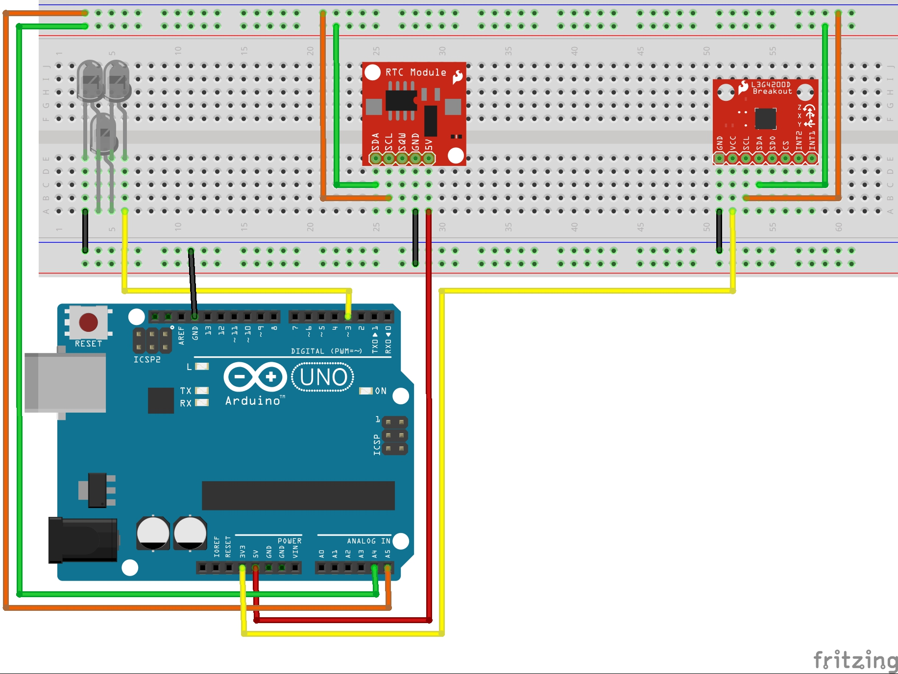

Arduino DysonRemote
====================

In winter it's cold at home and it's not nice to take a shower in those conditions.
I can turn on my [Dyson AM05 Hot + Cool](http://shop.dyson.fr/ventilateurs-et-chauffages/chauffages/am05-hot-cool-gris-bleu-300378-01) fifteen minutes before my shower but I prefer save my fifteen minutes to sleep.

This project turn on the Dyson on a specific time. I am happy to sleep more every days.

Dependencies
------------

### Modules

* Three infrared LEDs
* DS1307: RTC module. Needed to read the current DateTime.
* L3G4200D: Gyroscope. Used to read current temp because I do not have a thermometer module.

### Libraries

* [RTClib](https://github.com/adafruit/RTClib): Read date time for DS1307
* [L3G4200D](https://github.com/jarzebski/Arduino-L3G4200D): Read temperature on L3G4200D

Schema
------

License
-------

DysonRemote is released under the MIT License. See the bundled LICENSE file for details.
